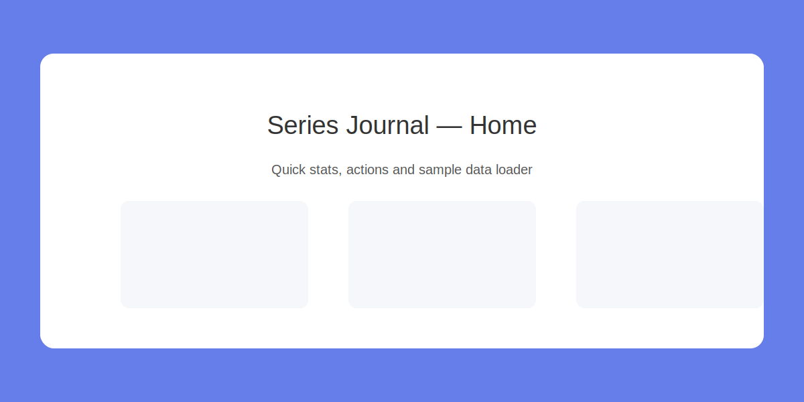
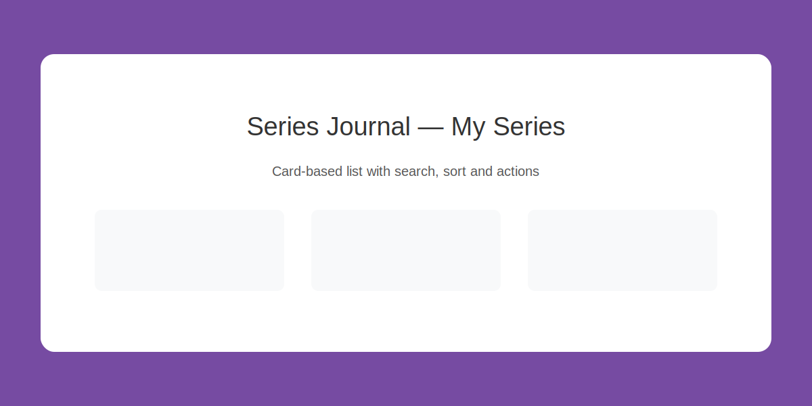
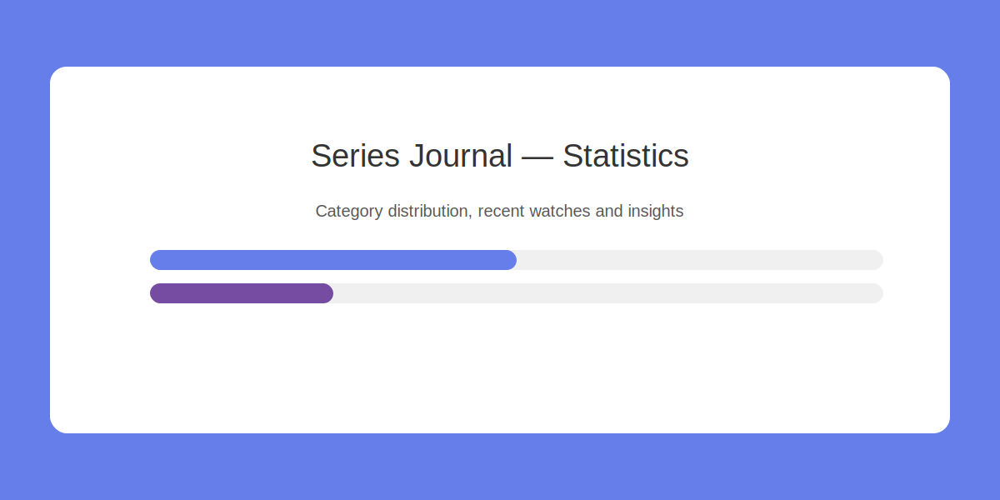

# 📺 Series Journal

A comprehensive React-based CRUD application for tracking and managing watched TV series.

[](https://react.dev/) [](https://vitejs.dev/) [](https://opensource.org/licenses/MIT)



## 🎯 Overview

**Series Journal** is a full-featured web application for TV series enthusiasts to track and manage their watching history. Built with modern React practices, it demonstrates complete CRUD operations, advanced filtering, statistics visualization, and persistent local storage.

**🎓 Academic Project**: Frontend Development Course - Phase 2
**👨‍💻 Developer**: [André Safar](https://github.com/SCSAndre)

---

## ✨ Key Features

### 🎬 Core Functionality
- **Create**: Add new series with comprehensive details (7 fields)
- **Read**: View all series in beautiful card-based layouts
- **Update**: Edit existing series with pre-filled forms
- **Delete**: Remove series with confirmation dialogs

### 🚀 Advanced Features
- **🔍 Smart Search**: Real-time filtering across multiple fields
- **🔄 Dynamic Sorting**: 6 sort options with ascending/descending toggle
- **📊 Statistics Dashboard**: Visual insights with category distribution, recently watched, and personalized analytics
- **💾 Auto-Save**: Persistent storage using browser's LocalStorage
- **✓ Form Validation**: Real-time validation with visual feedback
- **📱 Responsive Design**: Mobile-first, works on all devices

---

## 🛠️ Tech Stack

| Technology | Version | Purpose |
|------------|---------|---------|
| **React** | 19.1.1 | UI library with hooks |
| **Vite** | 7.1.7 | Build tool & dev server |
| **React Router** | 7.9.5 | Client-side routing |
| **Context API** | Built-in | State management |
| **CSS Modules** | Built-in | Scoped styling |
| **ESLint** | 9.36.0 | Code quality |

---

**Note:** This project uses custom styles implemented with `CSS Modules` for Phase 1. No external UI component library is included yet — see the Roadmap for planned UI library adoption in Phase 2.

## 🚀 Quick Start

### Prerequisites
- Node.js 16+ and npm 8+
- Modern browser (Chrome, Firefox, Safari, Edge)

### Installation

```bash
# Clone the repository
git clone https://github.com/SCSAndre/series-journal.git
cd series-journal

# Install dependencies
npm install

# Start development server
npm run dev
```

Visit `http://localhost:5173` in your browser.

### Available Scripts

```bash
npm run dev      # Start development server
npm run build    # Build for production
npm run preview  # Preview production build
npm run lint     # Run ESLint
```

---

## 📁 Project Structure

```
series-journal/
├── src/
│   ├── components/          # Reusable UI components
│   │   ├── NavBar/
│   │   ├── SerieForm/       # Form with validation
│   │   └── SerieList/       # Card-based list display
│   ├── pages/               # Route-based pages
│   │   ├── Home/
│   │   ├── List/
│   │   ├── Register/
│   │   ├── Edit/
│   │   ├── Statistics/
│   │   └── About/
│   ├── context/
│   │   └── SeriesContext.jsx  # Global state management
│   ├── App.jsx              # Main app component
│   └── main.jsx             # Entry point
├── public/                  # Static assets
├── package.json
└── vite.config.js
```

---

## 📖 Usage Guide

### Adding a New Series
1. Navigate to **"Add Series"** page
2. Fill in all required fields (title, seasons, dates, etc.)
3. Get real-time validation feedback
4. Submit to save automatically

### Viewing Your Collection
- Go to **"My Series"** to see all entries
- Use the search bar to filter by title, director, category, or production company
- Sort by any field (ascending/descending)
- Click **Edit** to modify or **Delete** to remove

### Viewing Statistics
- Visit **"Statistics"** page for insights
- See total series/seasons, favorite category
- View category distribution with visual bars
- Check recently watched series

---

## 🎨 Screenshots

### Home Page


### Series List


### Statistics


---

## 🧩 Component Architecture

### Core Components

#### **NavBar** (`src/components/NavBar/`)
- **Purpose**: Primary navigation across all pages
- **Features**: Active link highlighting, responsive design, smooth transitions
- **Props**: None (uses React Router's useLocation)

#### **SerieForm** (`src/components/SerieForm/`)
- **Purpose**: Handles both adding new series and editing existing ones
- **Features**: Real-time validation, visual feedback, controlled inputs, sanitization
- **Props**: `serieToEdit` (optional), `onSuccess` (callback), `onCancel` (callback)
- **Form Fields**: Title, seasons, release date, director, production company, category, date watched

#### **SerieList** (`src/components/SerieList/`)
- **Purpose**: Displays series collection in responsive card layout
- **Features**: Edit/delete actions, confirmation modals, hover effects, empty states
- **Props**: `series` (array of series objects)

#### **Loading** (`src/components/Loading/`)
- **Purpose**: Loading spinner with customizable message
- **Features**: Accessible design, CSS animations
- **Props**: `message` (optional custom text)

#### **Toast** (`src/components/Toast/`)
- **Purpose**: Non-blocking notification system
- **Features**: Auto-dismiss, success/error states, animations
- **Integration**: Connected to ToastContext

#### **ErrorBoundary** (`src/components/ErrorBoundary/`)
- **Purpose**: Catches React errors and displays fallback UI
- **Features**: Error logging, user-friendly error messages
- **Scope**: Wraps entire application

### Context Providers

#### **SeriesContext** (`src/context/SeriesContext.jsx`)
- **Purpose**: Global state management for series data
- **Features**: CRUD operations, filtering, sorting, statistics
- **Provides**: series array, loading states, search/sort functions

#### **ToastContext** (`src/context/ToastContext.jsx`)
- **Purpose**: Global notification system
- **Features**: Queue management, auto-dismiss timers
- **Integration**: Used by forms and API operations

### Page Components

#### **Home** (`src/pages/Home/`)
- **Purpose**: Welcome page with overview and quick actions
- **Features**: Statistics preview, call-to-action buttons, sample data loader

#### **List** (`src/pages/List/`)
- **Purpose**: Main series collection view
- **Features**: Search bar, sort controls, series grid, empty states

#### **Register** (`src/pages/Register/`)
- **Purpose**: Add new series form page
- **Features**: SerieForm integration, success handling, validation

#### **Edit** (`src/pages/Edit/`)
- **Purpose**: Edit existing series
- **Features**: Pre-filled form, route parameters, update confirmation

#### **Statistics** (`src/pages/Statistics/`)
- **Purpose**: Data visualization and insights
- **Features**: Charts, category distribution, recently watched, totals

#### **About** (`src/pages/About/`)
- **Purpose**: Project information and documentation
- **Features**: Technology stack details, learning outcomes

### Utility Modules

#### **sanitize.js** (`src/utils/sanitize.js`)
- **Purpose**: Input sanitization and validation
- **Functions**: `sanitizeInput()`, `sanitizeObject()`, `sanitizeEmail()`
- **Security**: XSS prevention, script tag removal

#### **useKeyboardShortcuts** (`src/hooks/useKeyboardShortcuts.js`)
- **Purpose**: Custom hooks for keyboard interactions
- **Features**: ESC key handling, shortcut management

---

## 💾 Data Model

```javascript
{
  id: "unique-id",
  title: "Breaking Bad",
  numberOfSeasons: 5,
  releaseDate: "2008-01-20",
  director: "Vince Gilligan",
  productionCompany: "AMC",
  category: "Drama",
  dateWatched: "2024-01-15",
  createdAt: "2024-01-15T10:30:00Z"
}
```

**Categories**: Drama, Comedy, Action, Thriller, Sci-Fi, Fantasy, Horror, Documentary, Animation, Romance

---

## 🔧 Configuration

### Environment Variables
If you run the optional backend API, set the base URL with Vite env var `VITE_API_BASE_URL`.
By default the app falls back to `http://localhost:5000`.

Example `.env` file at project root:

```
VITE_API_BASE_URL=http://localhost:5000
```

### Browser Support
- Chrome/Edge (Chromium) ✅
- Firefox ✅
- Safari ✅
- Modern mobile browsers ✅

---

## 🧪 Testing

### Automated Tests ✅
The project includes a comprehensive test suite with **18 passing tests**:

```bash
# Run all tests once
npm test

# Run tests in watch mode  
npm test -- --watch

# Run tests with UI dashboard
npm test:ui

# Run specific test file
npm test -- src/utils/sanitize.test.js
```

**Test Coverage:**
- ✅ Utility functions (sanitization, validation)
- ✅ UI components (Loading, Forms)
- ✅ 18/18 tests passing

### Manual Testing
Recommended manual tests:
1. Add/Edit/Delete series operations
2. Search and sort functionality  
3. Responsive design on different screen sizes
4. Form validation and error handling

---

## 📦 Deployment

### Build for Production

```bash
npm run build
```

Output will be in `dist/` folder.

### Deploy to Vercel

```bash
npm install -g vercel
vercel --prod
```

### Deploy to Netlify

```bash
npm install -g netlify-cli
netlify deploy --prod --dir=dist
```

---

## 🤝 Contributing

This is an academic project. Suggestions and feedback are welcome!

1. Fork the repository
2. Create a feature branch (`git checkout -b feature/improvement`)
3. Commit changes (`git commit -m 'Add improvement'`)
4. Push to branch (`git push origin feature/improvement`)
5. Open a Pull Request

---

## 🚀 Roadmap (Phase 2)

- [ ] External TV series API integration (TMDB)
- [ ] UI component library (Material-UI)
- [ ] Unit & integration tests
- [ ] TypeScript migration
- [ ] Series poster images
- [ ] Rating system
- [ ] Export/Import data
- [ ] Dark mode
- [ ] User authentication
- [ ] Cloud storage

---

## 📝 License

This project is licensed under the MIT License - see the [LICENSE](LICENSE) file for details.

---

## 👨‍💻 Author

**André Safar**
- GitHub: [@SCSAndre](https://github.com/SCSAndre)
- Project: Frontend Development Course - Phase 2
- Institution: College Project
- Year: 2025

---

## 🙏 Acknowledgments

- React documentation and community
- Vite team for the amazing build tool
- Frontend Development Course instructors
- Open-source contributors

---

## 📞 Support

For questions or issues, please open an issue on GitHub.

---

**⭐ Star this repository if you find it helpful!**

**Built with ❤️ using React + Vite**
